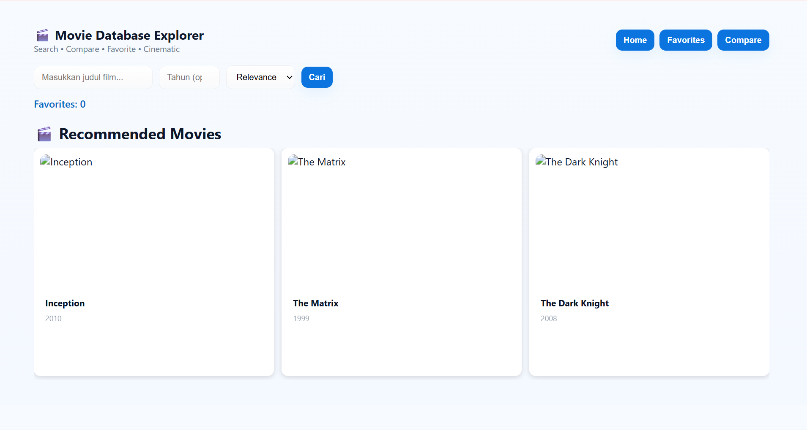
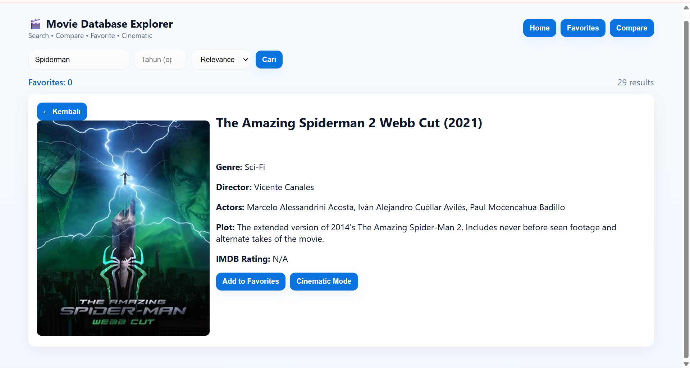
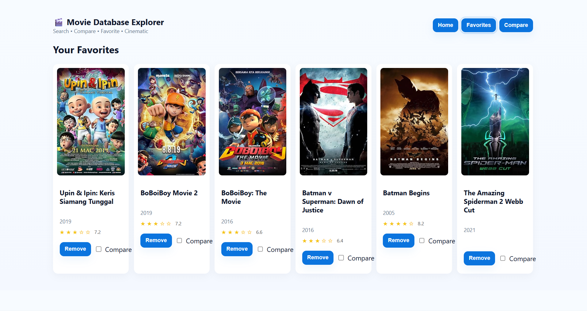

#  🎬 Movie Database Explorer

##  👤 Identitas Pembuat
**Nama:** Gian Ivander
**NIM:** 123140040
**Mata Kuliah:** Pengembangan Aplikasi Web
**Studi Kasus:** Digit 0 - Movie Database App

---

## 📝 Deskripsi Project
Aplikasi **Movie Database Explorer** adalah web app interaktif untuk mencari informasi film menggunakan **OMDb API**.
Pengguna dapat melakukan pencarian film berdasarkan judul dan tahun, melihat detail film, menandai favorit, serta membandingkan film pilihan.

**Fitur utama:**
- Form pencarian film (menggunakan filter tahun dan sorting)
- Tampilan hasil pencarian dalam bentuk grid responsif
- Detail film dalam card
- Tambah dan hapus film favorit yang tersimpan di localStorage
- Rating visual
- Halaman khusus "Favorites"
- Rekomendasi film otomatis di homepage
- Pagination dinamis berdasarkan lebar layar

---

## ⚙️ Cara Instalasi dan Menjalankan

### 1. Clone Repository
```bash
git clone https://github.com/15-040-GianIvander/uts_pemweb_123140040.git
cd uts_pengweb_123140040

### 2. Install Dependencies
Pastikan Node.js sudah terinstall, lalu jalankan 
npm install

### 3. Buat File .env
Isi dengan API Key dari OMDB API
VITE_OMDB_API_KEY=d480045c

### 4. Jalankan Server Development
npm run dev

### 5. Build untuk Production
npm run build

## 🚀 Link Deployment
Link Preview: https://utspemweb123140040.vercel.app/

## 🖼️ Screenshot Aplikasi
### Homepage

### Detail Film

### Favorites Page

